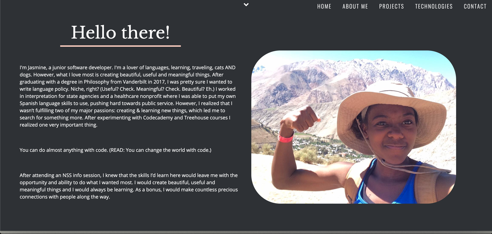
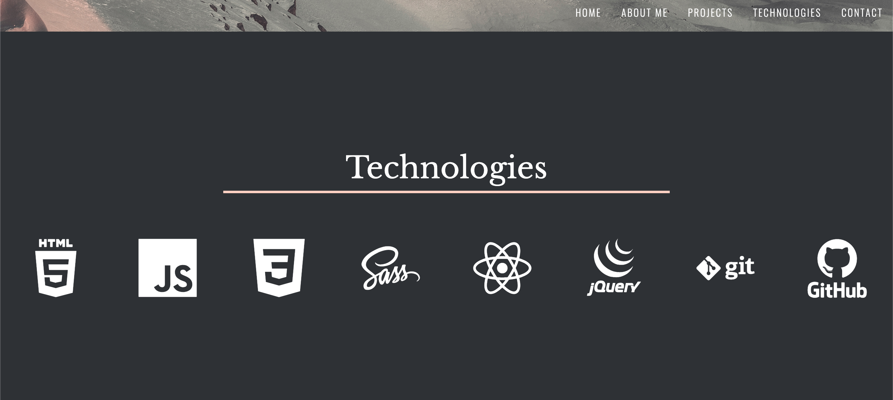

# Personal Site

https://personal-site-24536.firebaseapp.com/

## Description

Run this application to view my personal developer website. Use the navigation bar to view each section of my site.

## Screenshots

## How to run

- Clone down this project.
- Install [http-server](https://www.npmjs.com/package/http-server) from npm.
- At the root of this project, run the following command: `hs -p 8080`
- In your browser, navigate to `https://localhost:8080`
